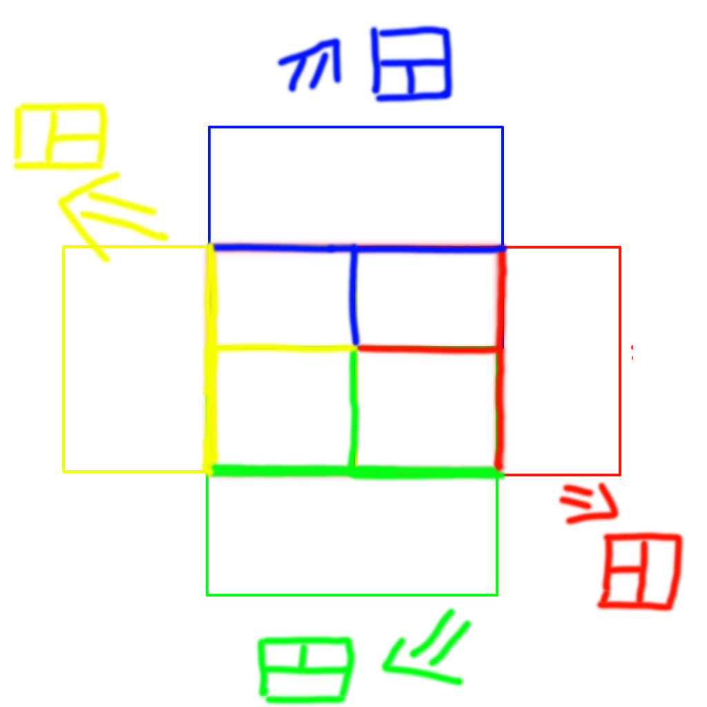
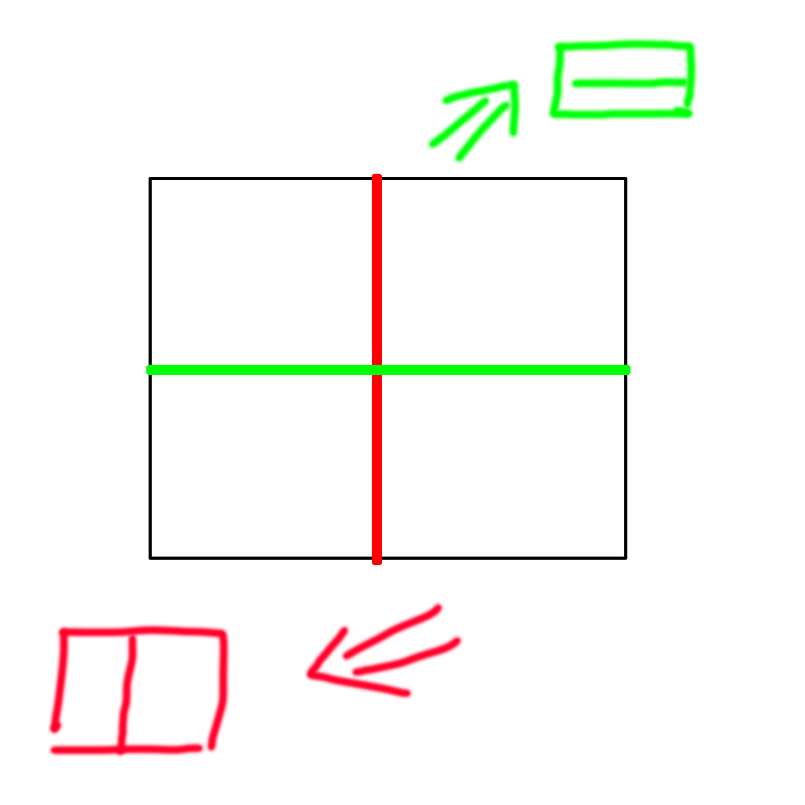
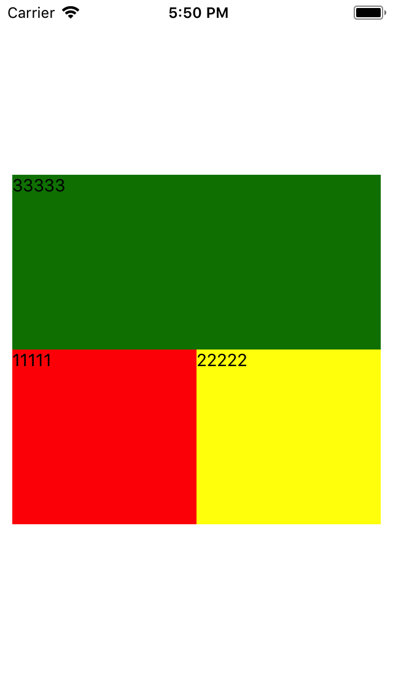
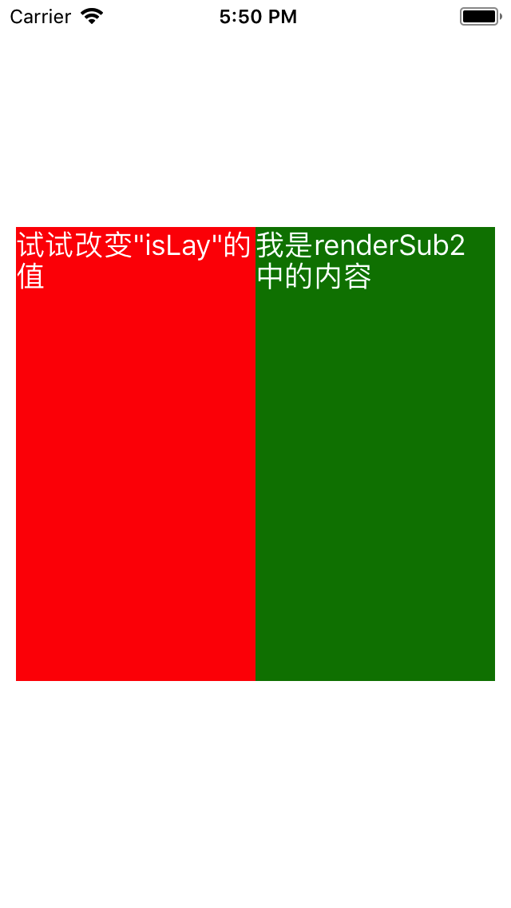

# react-native-quick-layout

## Why?

In this examle,I have a lot of textinput and have to exposure properties of member.So why not create TLayout component independently?


### TLayout
In TLayout,We hava a lot different T to Show.


### ILayout
In ILayout,the layout is divided into the upper and lower layout and the left and right layout



## Install

    npm i react-native-quick-layout --save
or use yarn 

    yarn add react-native-quick-layout
## Usage
using ES6 modules and destructuring..

```js
import {
  ILayout,
  TLayout,
} from 'react-native-quick-layout';

```


## Examples

### TLayout


```javascript
const tstyle = StyleSheet.create({
  TContainer: {
    flex: 0.5,
    backgroundColor: 'yellow',
    width: 300,
  },
  mid: { backgroundColor: 'gray', flex: 1 },
  sub1: {
    backgroundColor: 'red',
    flex: 1,
  },
  sub2: {
    backgroundColor: 'yellow',
    flex: 1,
  },
  sub3: {
    backgroundColor: 'green',
    flex: 1,
  },
  text: {
    color: 'white',
    fontSize: 18
  },
});


    const tLayout = (
      <TLayout
        position={TLayout.Position.bottom}
        containerStyle={tstyle.TContainer}
        renderSub1={<View><Text>11111</Text></View>}
        
        renderSub2={<View><Text>22222</Text></View>}
        renderSub3={<View><Text>33333</Text></View>}
        sub1Style={tstyle.sub1}
        sub2Style={tstyle.sub2}
        sub1And2ContainerStyle={tstyle.mid}
        sud3ContainerStyle={tstyle.sub3}
      />
    );


```


### ILayout


```javascript
const istyle = StyleSheet.create({
  IContainer: {
    flex: 0.5,
    backgroundColor: 'yellow',
    width: 300,
  },
  sub1: {
    backgroundColor: 'red',
    flex: 1,
  },
  sub2: {
    backgroundColor: 'green',
    flex: 1,
  },
  text: {
    color: 'white',
    fontSize: 18
  },
});


    const iLayout = (
      <ILayout
        isLay={false}
        containerStyle={istyle.IContainer}
        sub1Style={istyle.sub1}
        sub2Style={istyle.sub2}
        renderSub1={<Text style={istyle.text}>试试改变"isLay"的值</Text>}
        renderSub2={<Text style={istyle.text}>我是renderSub2中的内容</Text>}
      />
    )

```


## License
MIT